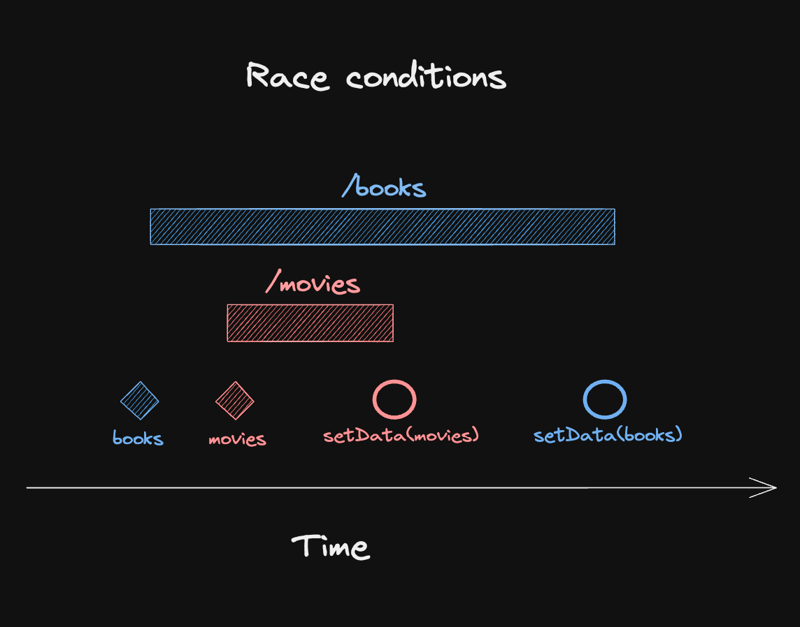
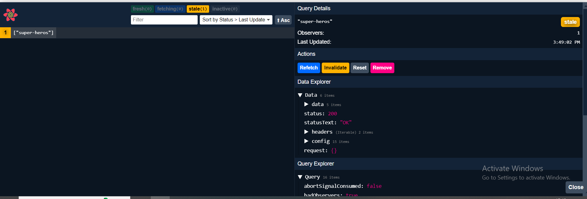

# React Query

### What is React Query?
- TanStack Query (FKA React Query) is often described as the missing data-fetching library for web applications, but in more technical terms, it makes fetching, caching, synchronizing and updating server state in your web applications a breeze.

### But we have useEffect Right?
- Lets consider this code.

```javascript
function Bookmarks({ category }) {
  const [data, setData] = useState([])
  const [error, setError] = useState()

  useEffect(() => {
    fetch(`${endpoint}/${category}`)
      .then(res => res.json())
      .then(d => setData(d))
      .catch(e => setError(e))
  }, [category])

  // Return JSX based on data and error state
}
```
- If you think this code is fine for simple use cases where you don't need additional features, let me tell you that I immediately spotted 🐛 5 bugs 🪲 hiding in these 10 lines of code.

    #### 1. Race Condition
    - The effect is set up in a way that it re-fetches whenever category changes, which is certainly correct. 
    - However, network responses can arrive in a different order than you sent them. So if you change the category from books to movies and the response for books arrives before the response for movies, you'll end up with the wrong data in your component.

    

    - At the end, you'll be left with an inconsistent state: Your local state will say that you have movies selected, but the data you're rendering is actually books.

    - React says we can fix this issue using ignore.

    ```javascript
    function Bookmarks({ category }) {
  const [data, setData] = useState([])
  const [error, setError] = useState()

  useEffect(() => {
    let ignore = false
    fetch(`${endpoint}/${category}`)
      .then(res => res.json())
      .then(d => {
        if (!ignore) {
          setData(d)
        }
      })
      .catch(e => {
        if (!ignore) {
          setError(e)
        }
      })
      return () => {
        ignore = true
      }
  }, [category])

  // Return JSX based on data and error state
    }
    ```
    - What happens now is that the effect cleanup function runs when category changes, setting the local ignore flag to true. If a fetch response comes in after that, it will not call setState anymore. Easy peasy.


    #### 2. Loading state 
    - It's not there at all. We have no way to show a pending UI while the requests are happening - not for the first one and not for further requests. So, let's add that?

    ```javascript
    function Bookmarks({ category }) {
  const [isLoading, setIsLoading] = useState(true)
  const [data, setData] = useState([])
  const [error, setError] = useState()

  useEffect(() => {
    let ignore = false
    setIsLoading(true)
    fetch(`${endpoint}/${category}`)
      .then(res => res.json())
      .then(d => {
        if (!ignore) {
          setData(d)
        }
      })
      .catch(e => {
        if (!ignore) {
          setError(e)
        }
      })
      .finally(() => {
        if (!ignore) {
          setIsLoading(false)
        }
      })
      return () => {
        ignore = true
      }
  }, [category])

  // Return JSX based on data and error state
    }   
    ``` 

    #### 3. Empty state
    - Initializing data with an empty array seems like a good idea to avoid having to check for undefined all the time - but what if we fetch data for a category that has no entries yet, and we actually get back an empty array? We'd have no way to distinguish between "no data yet" and "no data at all". The loading state we've just introduced helps, but it's still better to initialize with undefined:

    #### 4. Data & Error are not reset when category changes
    - Both data and error are separate state variables, and they don't get reset when category changes. That means if one category fails, and we switch to another one that is fetched successfully, our state will be:

    ```javascript
    data: dataFromCurrentCategory
    error: errorFromPreviousCategory
    ```

    - The result will then depend on how we actually render JSX based on this state. If we check for error first, we'll render the error UI with the old message even though we have valid data:
    ```javascript
    return (
  <div>
    { error ? (
      <div>Error: {error.message}</div>
    ) : (
      <ul>
        {data.map(item => (
          <li key={item.id}>{item.name}</div>
        ))}
      </ul>
    )}
  </div>
    )
    ```

    - If we check data first, we have the same problem if the second request fails. If we always render both error and data, we're also rendering potentially outdated information . 😔

    - To fix this, we have to reset our local state when category changes:

    ```javascript
    function Bookmarks({ category }) {
  const [isLoading, setIsLoading] = useState(true)
  const [data, setData] = useState()
  const [error, setError] = useState()

  useEffect(() => {
    let ignore = false
    setIsLoading(true)
    fetch(`${endpoint}/${category}`)
      .then(res => res.json())
      .then(d => {
        if (!ignore) {
          setData(d)
          setError(undefined)
        }
      })
      .catch(e => {
        if (!ignore) {
          setError(e)
          setData(undefined)
        }
      })
      .finally(() => {
        if (!ignore) {
          setIsLoading(false)
        }
      })
      return () => {
        ignore = true
      }
  }, [category])

  // Return JSX based on data and error state
    }
    ```

    - Our little "we just want to fetch data, how hard can it be?" useEffect hook became a giant mess of spaghetti code 🍝 as soon as we had to consider edge cases and state management. So what's the takeaway here?
    - **Data Fetching is simple.
    Async State Management is not.**

    - And this is where React Query comes in, because React Query is NOT a data fetching library - it's an async state manager. So when you say that you don't want it for doing something as simple as fetching data from an endpoint, you're actually right: Even with React Query, you need to write the same fetch code as before.

    - But you still need it to make that state predictably available in your app as easily as possible. Because let's be honest, I haven't written that ignore boolean code before I used React Query, and likely, neither have you. 😉

    - With React Query, the above code becomes:

    ```javascript
    function Bookmarks({ category }) {
  const { isLoading, data, error } = useQuery({
    queryKey: ['bookmarks', category],
    queryFn: () =>
      fetch(`${endpoint}/${category}`).then((res) => {
        if (!res.ok) {
          throw new Error('Failed to fetch')
        }
        return res.json()
      }),
  })

  // Return JSX based on data and error state
    }
    ```

    That's about 50% of the spaghetti code above, and just about the same amount as the original, buggy snippet was. And yes, this addresses all the bugs we found automatically:

 ####  🐛 Bugs
- 🏎️   There is no race condition because state is always stored by its input (category).
- 🕐   You get loading, data and error states for free, including discriminated unions on type level.
- 🗑️   Empty states are clearly separated and can further be enhanced with features like placeholderData.
- 🔄   You will not get data or error from a previous category unless you opt into it.
- 🔥   Multiple fetches are efficiently deduplicated, including those fired by StrictMode.

####  Cancellation
A lot of folks on twitter mentioned missing request cancellation in the original snippet. I don't think that's necessarily a bug - just a missing feature. Of course, React Query has you covered here as well with a pretty straightforward change:

```javascript
function Bookmarks({ category }) {
  const { isLoading, data, error } = useQuery({
    queryKey: ['bookmarks', category],
    queryFn: ({ signal }) =>
      fetch(`${endpoint}/${category}`, { signal }).then((res) => {
        if (!res.ok) {
          throw new Error('Failed to fetch')
        }
        return res.json()
      }),
  })

  // Return JSX based on data and error state
}
```

- Just take the signal you get into the queryFn, forward it to fetch, and requests will be aborted automatically when category changes. 🎉


### Installation:

``` 
npm i react-query
```

###  Setup:

```javascript 

import { QueryClientProvider, QueryClient } from "react-query";

const queryClient = new QueryClient();

ReactDOM.createRoot(document.getElementById("root")).render(
  <React.StrictMode>
    <QueryClientProvider client={queryClient} >
      <BrowserRouter>
        <App />
      </BrowserRouter>
    </QueryClientProvider>
  </React.StrictMode>
);

```

### useQuery:
- This hook required 2 arguments
    - Unique Key to identify the query.
    - function that return promise.
- Here if your using react-router to navigate inside the application  once a page has got its data from the api it gets stored in the react query memory and when you comeback to the same page after browseing other page you donot see loading data but in background react query makes api call's it will only re-render the page if there is change in data from the API.  


 ```javascript
 import { useQuery } from "react-query";
const RqSuperHero = () => {
  const { isLoading, data } = useQuery("super-heros", () => {
    return axios.get("http://localhost:4000/superheroes");
  });

  if (isLoading) {
    return "Loading";
  }
  return (
    <div>
      {data?.data.map((item) => {
        return <li key={item.id}>{item.name}</li>;
      })}
    </div>
  );
};

 ```   

 OR

 ```javascript 

const fetchData=()=>{
    return axios.get("http://localhost:4000/superheroes");
}
const RqSuperHero = () => {  
  const { isLoading, data } = useQuery("super-heros", fetchData);

  if (isLoading) {
    return "Loading";
  }
  return (
    <div>
      {data?.data.map((item) => {
        return <li key={item.id}>{item.name}</li>;
      })}
    </div>
  );
};
 ```

  #### Handling Errors:

  ```javascript
  const fetchData=()=>{
    return axios.get("http://localhost:4000/superheroes1");
}
const RqSuperHero = () => {  
  const { isLoading, data, isError,error } = useQuery("super-heros", fetchData);

  if (isLoading) {
    return "Loading";
  }
  if(isError){
    return error.message;
  }
  return (
    <div>
      {data?.data.map((item) => {
        return <li key={item.id}>{item.name}</li>;
      })}
    </div>
  );
}; 

  ```

### React Query Dev Tools:



### Setup:

```javascript

import {ReactQueryDevtools} from 'react-query/devtools';

ReactDOM.createRoot(document.getElementById("root")).render(
  <React.StrictMode>
    <QueryClientProvider client={queryClient} >
      <BrowserRouter>
        <App />
      </BrowserRouter>
      <ReactQueryDevtools initialIsOpen={false}  position="bottom-right"/>
    </QueryClientProvider>
  </React.StrictMode>
);

```
### Caching:

#### isFetching:

- This object provides the status of api call that react query makes underneath, keeping isLoading to false.

```javascript
const {isLoading,isFetching}=useQuery('super-heros',fetchData);

console.log(isLoading,isFetching)

// {isLoading:false, isFetching:true}

```
#### Configure Cache Time:
- Default Cache Time is 5 mins
```javascript
 const { isLoading, data, isError,error } = useQuery("super-heros", fetchData, {cacheTime:5000}); 
```

#### Stale Time:

- Default stale time is 0 seconds.

- Used when you know that data will not change for peroid of time so you stop making api calls to the backend server.

- Example i know that the list of super heros will not change immediately or frequently in short duration of time. we can limit the api call that being made.

```javascript
 const { isLoading, data, isError,error } = useQuery("super-heros", fetchData, {
    stale:30000
  }); 
```

- So here once the data has been fetched data gets cached and when the user again visit the page before expiration of 30 second same old data will be shown to the user and api calls at the background will also not happened till the 30 sec duration is completed.


### Refetch Defaults:

#### refetchOnMount:
- **true**- This will refetch the data on Mount of the component if the data is Stale.

- **false**- will not refetch the data once if the data is fetched.

- "**always**"- will refetch the data no matter if the data is fresh or stale.

```javascript
 const { isLoading, data, isError,error } = useQuery("super-heros", fetchData, {
    refetchOnMount:true
  }); 
```

#### refetchOnWindowFocus:
- Works by Default make it false if you donot need this feature.
- Every Time you focus on the browser An API call is automatically happens in background if your data is **stale**.
- Marking it has **always** will refetch the data not matter if the data is stale or not.

```javascript
 const { isLoading, data, isError,error } = useQuery("super-heros", fetchData, {
    refetchOnWindowFocus:true
  }); 
```
### Pooling Data:
- It the process of fetching data at regular intervals.

#### refetchInterval:

- This make api request for every specified time period.

```javascript
  const { isLoading, data, isError,error } = useQuery("super-heros", fetchData, {
    refetchInterval:2000,
  });

```

#### refetchIntervalBackground:

- This will make api requests in background even browser is not in focus.
- this is not enabled by default.

```javascript

 const { isLoading, data, isError,error } = useQuery("super-heros", fetchData, {
    refetchOnWindowFocus:true,
    refetchIntervalBackground:true,
  });

```

### Fetch Data On User Event:

#### refetch:

- To fetch the data on click of button.

```javascript 
const { isLoading, data, isError,error,refetch } = useQuery("super-heros", fetchData,{});

<button onClick={refetch}>Refetch Data</button>
```

#### isFetching:
- To show the status of the fetching to tell user that data is loading status.

```javascript
const { isLoading, data, isError,error,refetch,isFetching } = useQuery("super-heros", fetchData,{});

if(isLoading || isFetching ){
  return "Data Loading";
}
```

### Success and Error Callbacks:

- This callback will be helpfull when you want to perform any action like opening the popup, modal or showing toast notifications.


```javascript

 const onSuccess = (data) => {
    console.log("success perform side kick",data);
  };
  const onError = (error) => {
    console.log("Error perform side kick",error);
  };

  const { isLoading, data, isError, error, refetch } = useQuery(
    "super-heros",
    fetchData,
    { onSuccess, onError }
  );

```

### Data Transformation:

- This could help us to transform the data even before the data could be consumed by the frontend component.

#### select:

- This will automatically get the APi data as an argument and once you have transformed over here and return it and now data which is destructed in useQuery will get the new transformed data.

```javascript

const { isLoading, data, isError, error, refetch } = useQuery(
    "super-heros",
    fetchData,
    { onSuccess, onError, select:(data)=>{
      return data.data.map(item=>item.name)
    } }
  );


return (
    <div>
      {data.map((item) => {
        return <li key={item}>{item}</li>;
      })}
      <br></br>
      <button onClick={refetch}>Refetch Data</button>
    </div>
  );

```

### Query By Id:
- Usecase when you want to get details of certain id like product details page.

```javascript
const fetchData = (id) => axios.get("http://localhost:4000/superheroes/" + id);
const RqSuperHeroDetails = () => {
  const { id } = useParams();
  const { data, isLoading } = useQuery(["super-here", id], () => fetchData(id));

  if (isLoading) {
    return "Loading...";
  }

  return <div>{data.data.name + " is   " + data.data.alterego}</div>;
};
```
- Here we use **['super-here',id]** this cache the data for each id otherwise it would show same data for all the id for few minutes.

OR

```javascript 
const fetchData = ({queryKey}) => axios.get("http://localhost:4000/superheroes/" + queryKey[1]);

const RqSuperHeroDetails = () => {
  const { id } = useParams();
  const { data, isLoading } = useQuery(["super-here",id], fetchData);

  if (isLoading) {
    return "Loading...";
  }

  return <div>{data.data.name + " is   " + data.data.alterego}</div>;
};

```


### Parallel Queries:
- Some time a single component need to call multiple apis to fetch nessary data.

- Just declare useQuery multiple times.

```javascript
const fetchSuperHeros=()=>axios.get('http://localhost:4000/superheroes')
const fetchPosts=()=>axios.get('http://localhost:4000/posts')


const ParallelQueryPage = () => {
    const{data:superHeroData}=useQuery('super-heros',fetchSuperHeros)
    const {data:postData,}=useQuery('super-posts',fetchPosts)
  return <div>ParallelQuery.pagP</div>;
}; 

```

### Dynamic Paralle Queries:

- Usecase let say a user has selected 2 or more heros and wanted to see their details so it is better to fetch data dynamically and we cannot use multiple use query as we donot know the no.of selections.

#### useQueries:
- This will return the array of query results.

```JSX
// in App.JSX
<Route path="/dynamic" component=<Dynamic heroId=[1,2,5]></Dynamic></Route>

// in Dynamic.jsx
const fetchData=(heroId)=>{
  return axios.post("...../${heroId}")
}

const Dynamic=()=>{
  const queryResult=useQuery(
    heroId.map((id)=>{
      return {
        queryKey:['super-key',id],
        queryFun:()=>fetchData(id)
      }
    })
  )
  console.log(queryResult)
  // logs array of results....

  return <div>Dynamic Page...</div>
}


```

### Dependent Queries:
- If you have a senario where result of one api depends on another API.

- Or if you want execute query one after the other.
- Use **enabled** option in useQuery

```JSX
// in App.JSX
<Route path='/dependent' element={<Dependent email="@SyedImam1998"/>}></Route> 

// In Dependent.JSX
const fetchData=(email)=>{
  return axios.post("...../${email}")
}
const fetchData2=(channelId)=>{
  return axios.post("...../${channelId}")
}

const Dependent=(props)=>{
const {data:user}=useQuery(['user'],()=>fetchData(props.email))
const channelId=user?.data.channelId;

const {data:course}=useQuery(['channelId'],()=>fetchData2(channelId),{
enabled:!!channelId // this means it will convert the channelId value to boolean, if it contains data then true if not then false.
})
}
```

### Intial Query Data:

- There may be times when you already have the initial data for a query available in your app and can simply provide it directly to your query. If and when this is the case, you can use the config.`initialData` option to set the initial data for a query and skip the initial loading state!

- Example:

    1. Superman
    2. Superman2
    3. Superman3

- When you click on any one above you will be navigated to ne page that shows the details of the clicked items.
- But what if you have a partial data that could be usefull for the details page here is where Intail Query Data could be usefull.

- As we have `QueryClientProvider client={queryClient}` declared in main.jsx we can make use of it.

```JSX
const queryClient= useQueryClient();

useQuery(['super-hero',heroId],()=>fetchData(heroId),{
  initialData:()=>{
    const hero=queryClient.getQueryData('super-heroes') /// this contins the data already So using this key we will fetch the data from react query and use it.
    ?.data?.find((hero)=>hero.id===parseInt(heroId))

    if(hero){
      return {data:hero}
    }else{
      return undefined // with this react query will understand and it will do hard reload.
    }
  }
})

```

### Paginated Queries:


```JSX 

const fetchData=(pageNumber)=>{
  return axios.post("...../limit=2&page=${pageNumber}")
}

const [pageNumber,setPageNumber]=React.useState(1);
const {data,isFetching}=useQuery(['colors',pageNumber],()=>fetchColors(pageNumber),{
  keepPreviousData:true, // this will show the old data till new data is not ready..
})

<button onClick={()=>setPageNumber((page)=>page-1) disabled={pageNumber===1}}>Prev</button>

<button onClick={()=>setPageNumber((page)=>page+1) disabled={pageNumber===4}}>Next</button>

{isFetching && "Loading"}// to show status that new data is being fetched.
```

### Infinite Queries:

- This is something like where we will show more data on click of button **LOAD MORE / SHOW MORE** where new data is added to the old data.

- make use of useInfiniteQuery

```JSX
const fetchData=(pageNumber)=>{
  return axios.post("...../limit=2&page=${pageNumber}")
}

const {data,isFetchingNextPage,hasNextPage,fetchNextPage,isFetching}=useInfinitQuery(
  ['colors'],
  fetchData,
  {
    getNextPageParam:(_lastPage,pages)=>{
      if(pages.length<4){
        return pages.length+1;
      }else{
        return undefined
      }
    }
  }
)
 

 return (

  <div>
  {data?.pages.map((group,i)=>{
    return (
      <Fragment key={i}>
      {
        group.data.map(color=>(
          <h2>
              {color.id}.{color.label}
          </h2>
        ))
      }
      </Fragment>
    )
  })}
  </div>


  <button disabled={!hasNextPage}
  onClick={fetchNextPage}
  >Load More</button>
 )

```

### Posting Data

#### Mutation:
- use this to post data to API.

```JSX
const addSuperHero=(data)=>axios.post('http://localhost:4000/superheros',data)

const {mutate:addHero,isLoading, isError,error}=useMutation(addSuperHero);

const handleClick=()=>{
  const hero={name,alterego};
  addHero(hero);
}
```

#### Query Invalidation:
- Help you to fetch latest data once new data has been added.

```JSX
const queryClient= useQueryClient();

const {mutate:addHero,isLoading, isError,error}=useMutation(addSuperHero,{
  onSuccess:()=>{
    queryClient.invalidateQueries('super-heros') // this invalidate the data that is present in key super-heros this will make react query to re-fetch the data.
  }
}); 

```

#### Handling Mutation Response:
- Once you have posted the data in return you will be getting the response which contain the data. So here we can avoid the extra another API get call to  get the latest data.


```JSX
const queryClient= useQueryClient();

const {mutate:addHero,isLoading, isError,error}=useMutation(addSuperHero,{
  onSuccess:(data)=>{
   queryClient.setQueryData('super-heroes',(oldQueryData)=>{ // here you are setting the data in react query...
    return {
      ...oldQueryData,
      data:[oldQueryData.data,data.data],
    }
   })
  }
}); 

```

#### Optimistic Update:

- When you want to show case that your app is super fast we do this by adding data to react query cache first and then do API call.
- This would give super fast experience..

- will be using these below option present in useMutation.

    - onMutate - called before the fire of useMutation and receives the same variables. Here we will be storing the data in react query even before api call has been made.

    - onError - Triggers when Mutation expereice any error
    - onSettled - After success of Mutation again an API call will be made to get data from the server


### Axios Interceptor:

- Imagine you're sending requests (like asking for information) to a server using Axios. Before your request reaches the server, an interceptor can step in. It can do things like adding headers to your request (extra information), logging the request, or handling errors.

- Similarly, when the server responds to your request, the interceptor can catch that response before it reaches your application. It can modify the response, log it, or handle any errors that might have occurred.

- So, in simple terms, an Axios interceptor helps you manage your requests and responses more efficiently by allowing you to intercept them and do additional tasks before they reach your application or after they come back from the server.

- This how you configure axios interceptor when working with React Query.

```javascript

import axios from 'axios';

const client=axios.create({baseURL:'http://localhost:4000/'})

export const request=({...options})=>{
  client.default.headers.common.Authorization=`Bearer Token`;
  const onSuccess=(resposne)=>resposne;
  const onError=(error)=>error;
  return client(option).then(onSuccess).catch(onError)
}


/// While using...

import {request} from '...';

request({url:'/addHeroes',method:'post',data:hero})
```
